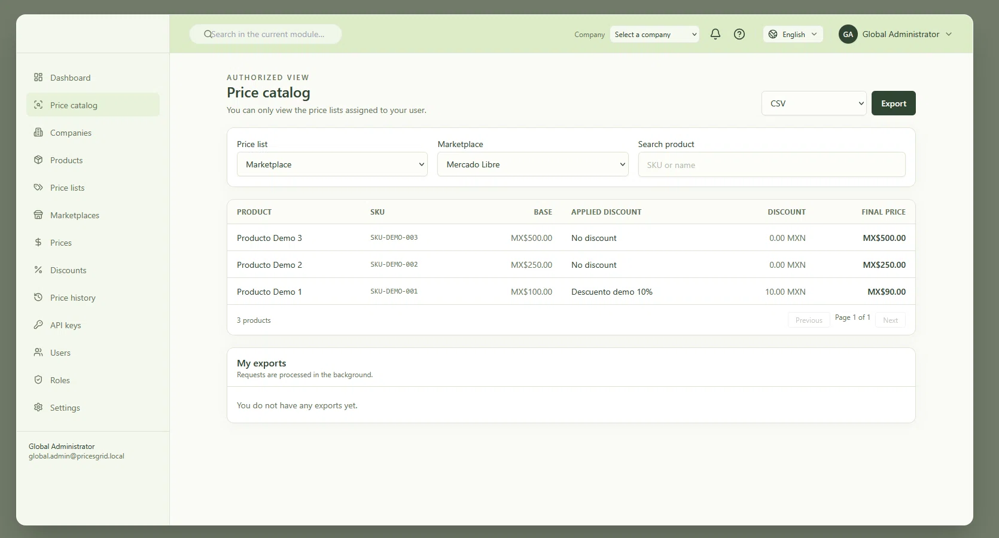

# Price Updater

[](LICENSE)
[](https://github.com/marcocantugea/price-updater/releases)
[](#stack--tecnolog%C3%ADas)
[](#stack--tecnolog%C3%ADas)
[](#stack--tecnolog%C3%ADas)
[](#stack--tecnolog%C3%ADas)
[](https://github.com/marcocantugea/price-updater/stargazers)

A **multi-tenant** administrative web application to capture, edit and propagate **product prices** across several marketplaces (Amazon, Mercado Libre and an owned store). · Aplicación web administrativa **multi-tenant** para capturar, editar y propagar **precios de productos** en varios marketplaces (Amazon, Mercado Libre y tienda propia).

- [English](#english)
- [Español](#español)



---

# English

## Table of contents

- [Overview](#overview)
- [Disclaimer](#disclaimer)
- [Features](#features)
- [Stack](#stack)
- [Prerequisites](#prerequisites)
- [Repository layout](#repository-layout)
- [Installation](#installation)
  - [1. Clone the repository](#1-clone-the-repository)
  - [2. Create the database](#2-create-the-database)
  - [3. Backend (API)](#3-backend-api)
  - [4. Frontend (Angular)](#4-frontend-angular)
  - [5. Verify](#5-verify)
- [Docker](#docker)
- [Initial credentials](#initial-credentials)
- [Environment variables](#environment-variables)
- [Useful scripts](#useful-scripts)
- [Tests](#tests)
- [Scope (Phase 1)](#scope-phase-1)
- [License](#license)

## Overview

Price Updater lets you manage a **price catalog** per company (tenant), with **discount** rules, **price history** and an **audit** trail of every change. Phase 1 delivers the architecture, database, authentication, multi-tenant isolation, the main CRUDs, pricing/discount rules, history, audit, seeds and unit tests. Its scope is the **administration of prices, products and discounts** — see the [Disclaimer](#disclaimer).

## Disclaimer

Price Updater is a tool for **administering prices, products and discounts** across different sales platforms (marketplaces). **Integration with those platforms is not part of the project's vision**: the application does not connect to Amazon, Mercado Libre or any other marketplace, and it does not synchronize data with them. Its scope is limited to the administration of prices, products and discounts.

## Features

- Authentication with **JWT** (access token) + **refresh token** in an `HttpOnly` cookie.
- **Multi-tenant isolation** in a single shared database (`tenant_id`).
- CRUD for: products, prices, price lists, marketplaces, brands, suppliers, units of measure, discounts, users, roles and companies.
- **Pricing engine**: a single discount (product → price list → marketplace → base), with currency-aware rounding.
- **Price history** (append-only) and an **audit** trail of who changed each record.
- **Read-only external API** protected by API keys (`X-API-Key`).
- **CSV / JSON / TXT** exports processed by a worker.
- **Internationalization** (i18n): Latin American Spanish (`es-419`) and US English (`en-US`).

## Stack

| Layer | Technology |
|-------|------------|
| Backend | Node.js 20+ · **Express 4** · TypeScript · **Prisma 5** · **tsyringe** (DI) · **Zod** (validation) · **pino** (logging) · **Jest** |
| Frontend | **Angular 19** · **Tailwind CSS 3** · **spartan/ui brain** · **lucide** · **ngx-charts** · **Transloco** (i18n) · **Jasmine + Karma** |
| Database | **MySQL 8** — a single shared database with `tenant_id` isolation |

## Prerequisites

- **Node.js 20+** (developed on Node 24) and **npm**.
- **MySQL 8** running (Laragon, XAMPP, Docker or a native install).

## Repository layout

```
src/
  backend/prices-api/     # REST API (Express + TypeScript) + Dockerfile
  frontend/prices-admin/  # Admin dashboard (Angular) + Dockerfile
docker-compose.yml        # Full Docker stack (MySQL, API, worker, web)
.env.docker.example       # Compose overrides — copy to .env
docs/screenshots/         # Images used by this README
README.md                 # This file
LICENSE                   # MIT License
```

## Installation

### 1. Clone the repository

```bash
git clone <repository-url>
cd price-updater
```

### 2. Create the database

Create the database (and, recommended, a dedicated user). The `pricesgrid` and `pricegrid_user_db` names are inherited values; you may change them, but then you must also adjust `DATABASE_URL` in `.env`.

```sql
CREATE DATABASE pricesgrid CHARACTER SET utf8mb4 COLLATE utf8mb4_unicode_ci;

-- Dedicated user (recommended)
CREATE USER 'pricegrid_user_db'@'localhost' IDENTIFIED BY '<strong-password>';
GRANT ALL PRIVILEGES ON pricesgrid.* TO 'pricegrid_user_db'@'localhost';
```

> For a throwaway local database you can also use `root` with no password: `DATABASE_URL="mysql://root@127.0.0.1:3306/pricesgrid"`.

### 3. Backend (API)

```bash
cd src/backend/prices-api

# 1) Install dependencies
npm install

# 2) Create the environment file
cp .env.example .env        # Windows: copy .env.example .env
#    -> edit DATABASE_URL and the JWT / API key secrets

# 3) Generate the Prisma client
npm run prisma:generate

# 4) Apply the schema (migrations own the STRUCTURE only)
npm run migrate:dev         # development (creates + applies)
# npm run migrate:deploy    # CI / staging / production

# 5) Insert the initial data (idempotent)
npm run seed

# 6) Start the API
npm run dev                 # http://localhost:3000
```

> If a later `git pull` brings a new migration, re-run step 4 before starting the API.

### 4. Frontend (Angular)

```bash
cd src/frontend/prices-admin

npm install
npm start                   # http://localhost:4200
```

> The dev server proxies requests to the API at `http://localhost:3000`. Start the backend first so login works.

### 5. Verify

```bash
curl http://localhost:3000/health
# { "status": "ok", "db": "up", "uptime": 3, "version": "1.0.0", "timestamp": "..." }
```

Open **http://localhost:4200** and log in with the credentials below.

## Docker

The repository ships one `Dockerfile` per application plus a
[`docker-compose.yml`](docker-compose.yml) that brings up the whole stack —
MySQL, the API, the export worker and the web client:

```bash
# from the repository root
docker compose up --build
```

| Service | URL / purpose |
|---------|---------------|
| `web` | http://localhost:4200 — the Angular client |
| `api` | http://localhost:3000 — the REST API (`GET /health`) |
| `worker` | processes the queued CSV / JSON / TXT exports |
| `migrate` | one-shot: applies the migrations and runs the seed, then exits |
| `db` | MySQL 8 — not published on the host by default |

The seeds create the two login accounts, so the credentials below work out of the
box. Every other value (secrets, ports, the API URL the bundle points at) can be
overridden by copying the example environment file:

```bash
cp .env.docker.example .env     # Windows: copy .env.docker.example .env
```

Two defaults matter before exposing the stack to the internet:

- `COOKIE_SECURE=false` — the stack serves plain HTTP, and a browser drops a
  `Secure` refresh cookie over HTTP, which would break the session. Set it to
  `true` once the application sits behind HTTPS.
- `ALLOW_DEMO_SEED=true` — the seeds create the demo company and its two
  accounts. Set it to `false` for a real deployment.

Useful commands:

```bash
docker compose logs -f api        # follow the API logs
docker compose run --rm migrate   # re-apply the migrations and the seeds
docker compose down               # stop, keeping the volumes
docker compose down -v            # stop and delete the database and the exports
```

**Deploying on another host.** The Angular bundle carries the API URL it was
built with, and the committed default is `http://localhost:3000/api/v1`. On a
remote server, set both values in `.env` before building:

```dotenv
WEB_API_URL=https://prices.example.com/api/v1
CORS_ORIGIN=https://prices.example.com
WEB_PORT=80
```

## Initial credentials

Created by the demo seeds from `.env` (development only).

| User | Email | Password | Role |
|------|-------|----------|------|
| Global administrator | `global.admin@pricesgrid.local` | `ChangeMe!123` | `global_admin` |
| Company administrator | `tenant.admin@pricesgrid.local` | `ChangeMe!123` | `tenant_admin` |

> ⚠️ Change these credentials in any non-local environment. Passwords are always stored hashed (bcrypt).

## Environment variables

File: `src/backend/prices-api/.env`

| Variable | Purpose | Default |
|----------|---------|---------|
| `NODE_ENV` | Environment (`development` enables demo seeds) | `development` |
| `PORT` | HTTP port | `3000` |
| `DATABASE_URL` | MySQL connection string | `mysql://root@127.0.0.1:3306/pricesgrid` |
| `JWT_ACCESS_SECRET` | Access-token signing secret | — |
| `JWT_REFRESH_SECRET` | Refresh-token hashing secret | — |
| `JWT_ACCESS_TTL` | Access-token lifetime | `15m` |
| `JWT_REFRESH_TTL_DAYS` | Refresh-token lifetime in days | `7` |
| `API_KEY_HASH_SECRET` | HMAC secret used to hash API keys | — |
| `CORS_ORIGIN` | Allowed frontend origin(s) | `http://localhost:4200` |
| `LOG_LEVEL` | `debug` \| `info` \| `warn` \| `error` | `info` |
| `ALLOW_DEMO_SEED` | Explicit opt-in for demo seeds | `true` in dev |
| `SEED_GLOBAL_ADMIN_EMAIL` / `SEED_GLOBAL_ADMIN_PASSWORD` | Initial global admin | see `.env.example` |
| `SEED_TENANT_ADMIN_EMAIL` / `SEED_TENANT_ADMIN_PASSWORD` | Initial company admin | see `.env.example` |
| `DATABASE_URL_TEST` | Separate database for the integration suite | — |

> Every variable is documented in `src/backend/prices-api/.env.example`.

## Useful scripts

### Backend (`src/backend/prices-api`)

| Script | Description |
|--------|-------------|
| `npm run dev` | Start the API in development (auto-reload) |
| `npm run build` / `npm start` | Build and run the API in production |
| `npm run prisma:generate` | Generate the Prisma client |
| `npm run migrate:dev` | Create + apply migrations (development) |
| `npm run migrate:deploy` | Apply pending migrations (CI/production) |
| `npm run seed` | Load the initial data (idempotent) |
| `npm run seed:demo-api-key` | Generate a demo API key (optional) |
| `npm run worker:exports` | Worker that processes CSV/JSON/TXT exports |
| `npm test` / `npm run test:cov` | Unit tests (Jest) |
| `npm run test:integration` | Integration suite against real MySQL |

### Frontend (`src/frontend/prices-admin`)

| Script | Description |
|--------|-------------|
| `npm start` | Development server (`ng serve`, port 4200) |
| `npm run build` | Production build (`dist/`) |
| `npm test` | Unit tests (Jasmine + Karma) |
| `npm run test:coverage` | Tests with coverage report |
| `npm run i18n:check` | Verify the i18n copy (ES/EN) |

## Tests

The backend uses **Jest** (no database needed: Prisma is mocked) plus an **integration** suite against real MySQL. The frontend uses **Jasmine + Karma** and **end-to-end** tests with Playwright. The main commands are in the scripts table above.

## Scope (Phase 1)

Outside the project's vision: **marketplace integration** — the application does not connect to or synchronize with Amazon, Mercado Libre or any other platform (see the [Disclaimer](#disclaimer)).

Out of scope for this phase: stacking discounts, write scopes on the external API, currency conversion and exchange rates, and inventory/images/variants.

## License

This project is distributed under the [MIT License](LICENSE). You are free to use, modify and redistribute the code, even commercially, as long as you keep the copyright and permission notices.

---

# Español

## Tabla de contenidos

- [Descripción](#descripción)
- [Aviso (Disclaimer)](#aviso-disclaimer)
- [Características](#características)
- [Stack / Tecnologías](#stack--tecnologías)
- [Requisitos previos](#requisitos-previos)
- [Estructura del repositorio](#estructura-del-repositorio)
- [Instalación](#instalación)
  - [1. Clonar el repositorio](#1-clonar-el-repositorio)
  - [2. Crear la base de datos](#2-crear-la-base-de-datos)
  - [3. Backend (API)](#3-backend-api)
  - [4. Frontend (Angular)](#4-frontend-angular)
  - [5. Verificar](#5-verificar)
- [Docker (contenedores)](#docker-contenedores)
- [Credenciales iniciales](#credenciales-iniciales)
- [Variables de entorno](#variables-de-entorno)
- [Scripts útiles](#scripts-útiles)
- [Pruebas](#pruebas)
- [Alcance (Fase 1)](#alcance-fase-1)
- [Licencia](#licencia)

## Descripción

Price Updater permite administrar un **catálogo de precios** por empresa (tenant), con reglas de **descuentos**, **historial de precios** y **auditoría** de cada cambio. La Fase 1 entrega la arquitectura, la base de datos, la autenticación, el aislamiento multi-tenant, los CRUD principales, las reglas de precios/descuentos, el historial, la auditoría, los seeds y las pruebas unitarias. Su alcance es la **administración de precios, productos y descuentos** — ver el [Aviso](#aviso-disclaimer).

## Aviso (Disclaimer)

Price Updater es una herramienta para **administrar precios, productos y descuentos** en distintas plataformas de venta (marketplaces). **La integración con esas plataformas no forma parte de la visión del proyecto**: la aplicación no se conecta a Amazon, Mercado Libre ni a ninguna otra plataforma, ni sincroniza datos con ellas. Su alcance se limita a la administración de precios, productos y descuentos.

## Características

- Autenticación con **JWT** (access token) + **refresh token** en cookie `HttpOnly`.
- **Aislamiento multi-tenant** en una sola base de datos compartida (`tenant_id`).
- CRUD de: productos, precios, listas de precios, marketplaces, marcas, proveedores, unidades de medida, descuentos, usuarios, roles y empresas.
- **Motor de precios**: un solo descuento (producto → lista de precios → marketplace → base), con redondeo según la moneda.
- **Historial de precios** (append-only) y **auditoría** de quién modificó cada registro.
- **API externa de solo lectura** protegida por API keys (`X-API-Key`).
- Exportaciones a **CSV / JSON / TXT** procesadas por un worker.
- **Internacionalización** (i18n): español de Latinoamérica (`es-419`) e inglés (`en-US`).

## Stack / Tecnologías

| Capa | Tecnología |
|------|------------|
| Backend | Node.js 20+ · **Express 4** · TypeScript · **Prisma 5** · **tsyringe** (DI) · **Zod** (validación) · **pino** (logs) · **Jest** |
| Frontend | **Angular 19** · **Tailwind CSS 3** · **spartan/ui brain** · **lucide** · **ngx-charts** · **Transloco** (i18n) · **Jasmine + Karma** |
| Base de datos | **MySQL 8** — una sola base compartida con aislamiento por `tenant_id` |

## Requisitos previos

- **Node.js 20+** (desarrollado sobre Node 24) y **npm**.
- **MySQL 8** en ejecución (Laragon, XAMPP, Docker o instalación nativa).

## Estructura del repositorio

```
src/
  backend/prices-api/     # API REST (Express + TypeScript) + Dockerfile
  frontend/prices-admin/  # Panel de administración (Angular) + Dockerfile
docker-compose.yml        # Stack Docker completo (MySQL, API, worker, web)
.env.docker.example       # Ajustes de Compose — copiar a .env
docs/screenshots/         # Imágenes usadas por este README
README.md                 # Este archivo
LICENSE                   # Licencia MIT
```

## Instalación

### 1. Clonar el repositorio

```bash
git clone <url-del-repositorio>
cd price-updater
```

### 2. Crear la base de datos

Crea la base de datos (y, recomendado, un usuario dedicado). Los nombres `pricesgrid` y `pricegrid_user_db` son valores heredados; puedes cambiarlos, pero entonces también debes ajustar `DATABASE_URL` en el `.env`.

```sql
CREATE DATABASE pricesgrid CHARACTER SET utf8mb4 COLLATE utf8mb4_unicode_ci;

-- Usuario dedicado (recomendado)
CREATE USER 'pricegrid_user_db'@'localhost' IDENTIFIED BY '<contraseña-fuerte>';
GRANT ALL PRIVILEGES ON pricesgrid.* TO 'pricegrid_user_db'@'localhost';
```

> Para un entorno local desechable también puedes usar `root` sin contraseña: `DATABASE_URL="mysql://root@127.0.0.1:3306/pricesgrid"`.

### 3. Backend (API)

```bash
cd src/backend/prices-api

# 1) Instalar dependencias
npm install

# 2) Crear el archivo de entorno
cp .env.example .env        # Windows: copy .env.example .env
#    -> edita DATABASE_URL y los secretos JWT / API key

# 3) Generar el cliente Prisma
npm run prisma:generate

# 4) Aplicar el esquema (las migraciones solo crean la ESTRUCTURA)
npm run migrate:dev         # desarrollo (crea + aplica)
# npm run migrate:deploy    # CI / staging / producción

# 5) Insertar los datos iniciales (idempotente)
npm run seed

# 6) Iniciar la API
npm run dev                 # http://localhost:3000
```

> Si luego haces `git pull` y trae una migración nueva, vuelve a ejecutar el paso 4 antes de arrancar la API.

### 4. Frontend (Angular)

```bash
cd src/frontend/prices-admin

npm install
npm start                   # http://localhost:4200
```

> El servidor de desarrollo proxea las peticiones a la API en `http://localhost:3000`. Arranca primero el backend para que el login funcione.

### 5. Verificar

```bash
curl http://localhost:3000/health
# { "status": "ok", "db": "up", "uptime": 3, "version": "1.0.0", "timestamp": "..." }
```

Abre **http://localhost:4200** e inicia sesión con las credenciales de abajo.

## Docker (contenedores)

El repositorio incluye un `Dockerfile` por aplicación y un
[`docker-compose.yml`](docker-compose.yml) que levanta todo el stack — MySQL, la
API, el worker de exportaciones y el cliente web:

```bash
# desde la raíz del repositorio
docker compose up --build
```

| Servicio | URL / función |
|----------|---------------|
| `web` | http://localhost:4200 — el cliente Angular |
| `api` | http://localhost:3000 — la API REST (`GET /health`) |
| `worker` | procesa las exportaciones CSV / JSON / TXT en cola |
| `migrate` | de un solo uso: aplica las migraciones y ejecuta el seed, luego sale |
| `db` | MySQL 8 — no se publica en el host por defecto |

Los seeds crean las dos cuentas de acceso, así que las credenciales de abajo
funcionan directamente. Cualquier otro valor (secretos, puertos, la URL de la API
que usa el bundle) se puede sobrescribir copiando el archivo de ejemplo:

```bash
cp .env.docker.example .env     # Windows: copy .env.docker.example .env
```

Dos valores por defecto conviene conocerlos antes de exponer el stack a internet:

- `COOKIE_SECURE=false` — el stack sirve HTTP en claro y el navegador descarta
  una cookie de refresco `Secure` sobre HTTP, lo que rompería la sesión.
  Actívalo cuando la aplicación esté detrás de HTTPS.
- `ALLOW_DEMO_SEED=true` — los seeds crean la empresa demo y sus dos cuentas.
  Ponlo en `false` para un despliegue real.

Comandos útiles:

```bash
docker compose logs -f api        # seguir los logs de la API
docker compose run --rm migrate   # volver a aplicar migraciones y seeds
docker compose down               # detener, conservando los volúmenes
docker compose down -v            # detener y borrar la base de datos y las exportaciones
```

**Desplegar en otro host.** El bundle de Angular lleva compilada la URL de la API
y el valor por defecto es `http://localhost:3000/api/v1`. En un servidor remoto,
configura ambos valores en `.env` antes de construir:

```dotenv
WEB_API_URL=https://prices.example.com/api/v1
CORS_ORIGIN=https://prices.example.com
WEB_PORT=80
```

## Credenciales iniciales

Creadas por los seeds de demostración a partir del `.env` (solo en desarrollo).

| Usuario | Email | Contraseña | Rol |
|---------|-------|------------|-----|
| Administrador global | `global.admin@pricesgrid.local` | `ChangeMe!123` | `global_admin` |
| Administrador de empresa | `tenant.admin@pricesgrid.local` | `ChangeMe!123` | `tenant_admin` |

> ⚠️ Cambia estas credenciales en cualquier entorno que no sea local. Las contraseñas siempre se guardan con hash (bcrypt).

## Variables de entorno

Archivo: `src/backend/prices-api/.env`

| Variable | Propósito | Valor por defecto |
|----------|-----------|-------------------|
| `NODE_ENV` | Entorno (`development` habilita seeds demo) | `development` |
| `PORT` | Puerto HTTP | `3000` |
| `DATABASE_URL` | Cadena de conexión MySQL | `mysql://root@127.0.0.1:3306/pricesgrid` |
| `JWT_ACCESS_SECRET` | Secreto del access token | — |
| `JWT_REFRESH_SECRET` | Secreto del refresh token | — |
| `JWT_ACCESS_TTL` | Vida del access token | `15m` |
| `JWT_REFRESH_TTL_DAYS` | Vida del refresh token (días) | `7` |
| `API_KEY_HASH_SECRET` | Secreto HMAC para hashear API keys | — |
| `CORS_ORIGIN` | Origen(es) permitidos del frontend | `http://localhost:4200` |
| `LOG_LEVEL` | `debug` \| `info` \| `warn` \| `error` | `info` |
| `ALLOW_DEMO_SEED` | Habilita explícitamente los seeds demo | `true` en dev |
| `SEED_GLOBAL_ADMIN_EMAIL` / `SEED_GLOBAL_ADMIN_PASSWORD` | Admin global inicial | ver `.env.example` |
| `SEED_TENANT_ADMIN_EMAIL` / `SEED_TENANT_ADMIN_PASSWORD` | Admin de empresa inicial | ver `.env.example` |
| `DATABASE_URL_TEST` | Base separada para la suite de integración | — |

> Todas las variables están documentadas en `src/backend/prices-api/.env.example`.

## Scripts útiles

### Backend (`src/backend/prices-api`)

| Script | Descripción |
|--------|-------------|
| `npm run dev` | Inicia la API en modo desarrollo (recarga automática) |
| `npm run build` / `npm start` | Compila y arranca la API en producción |
| `npm run prisma:generate` | Genera el cliente Prisma |
| `npm run migrate:dev` | Crea + aplica migraciones (desarrollo) |
| `npm run migrate:deploy` | Aplica migraciones pendientes (CI/producción) |
| `npm run seed` | Carga los datos iniciales (idempotente) |
| `npm run seed:demo-api-key` | Genera una API key de demostración (opcional) |
| `npm run worker:exports` | Worker que procesa las exportaciones CSV/JSON/TXT |
| `npm test` / `npm run test:cov` | Pruebas unitarias (Jest) |
| `npm run test:integration` | Suite de integración contra MySQL real |

### Frontend (`src/frontend/prices-admin`)

| Script | Descripción |
|--------|-------------|
| `npm start` | Servidor de desarrollo (`ng serve`, puerto 4200) |
| `npm run build` | Compila para producción (`dist/`) |
| `npm test` | Pruebas unitarias (Jasmine + Karma) |
| `npm run test:coverage` | Pruebas con reporte de cobertura |
| `npm run i18n:check` | Verifica la copia i18n (ES/EN) |

## Pruebas

El backend usa **Jest** (sin base de datos: Prisma se simula) y una suite de **integración** contra MySQL real. El frontend usa **Jasmine + Karma** y pruebas **end-to-end** con Playwright. Los comandos principales están en la tabla de scripts de arriba.

## Alcance (Fase 1)

Fuera de la visión del proyecto: **la integración con los marketplaces** — la aplicación no se conecta ni sincroniza con Amazon, Mercado Libre ni ninguna otra plataforma (ver el [Aviso](#aviso-disclaimer)).

Fuera del alcance de esta fase: descuentos acumulables, scopes de escritura en la API externa, conversión de moneda y tipos de cambio, e inventario/imágenes/variantes.

## Licencia

Este proyecto se distribuye bajo la [Licencia MIT](LICENSE). Eres libre de usar, modificar y redistribuir el código, incluso en software comercial, siempre que conserves el aviso de copyright y de permiso.
